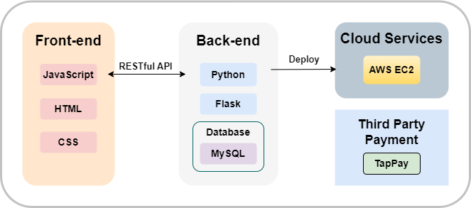
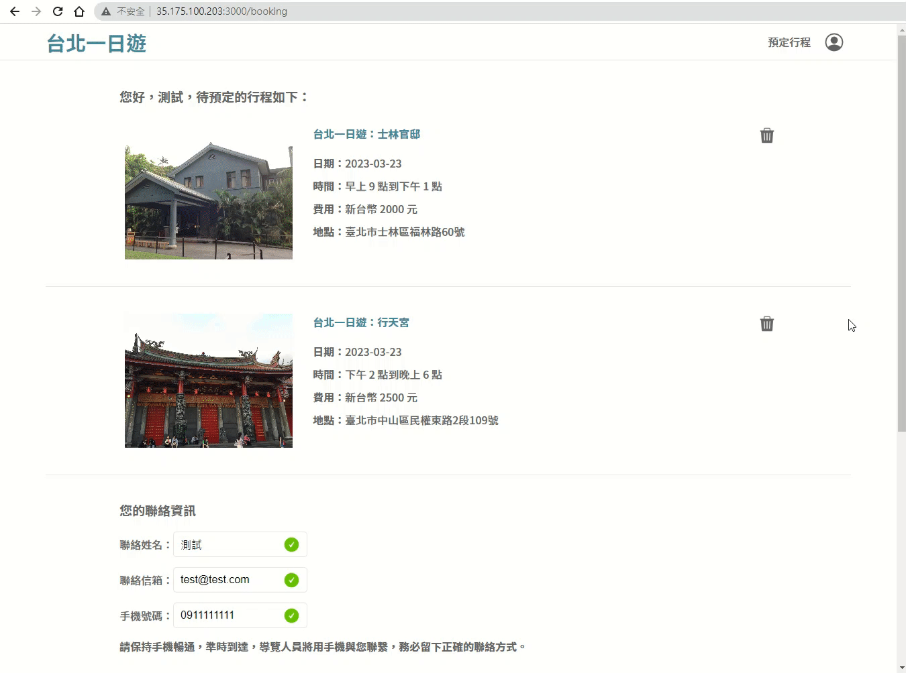
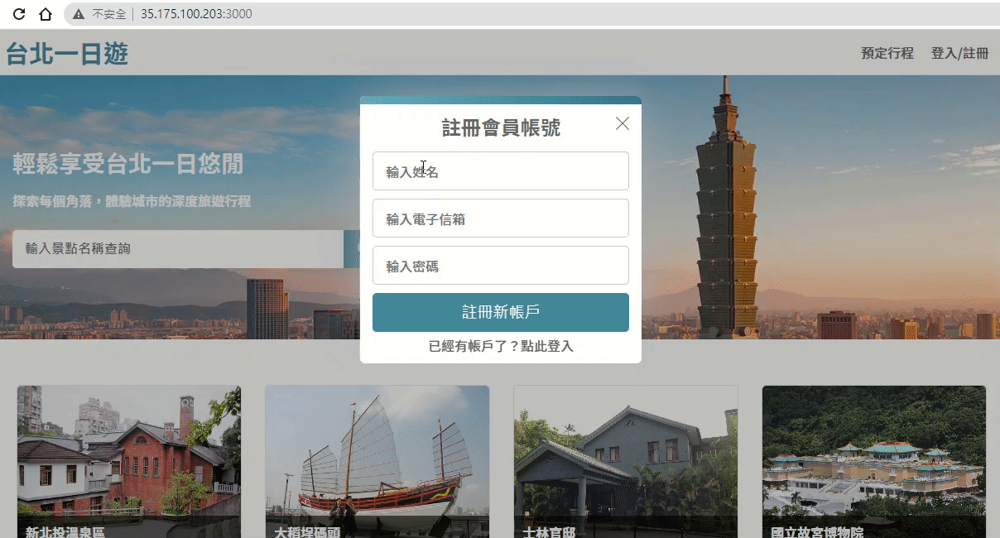
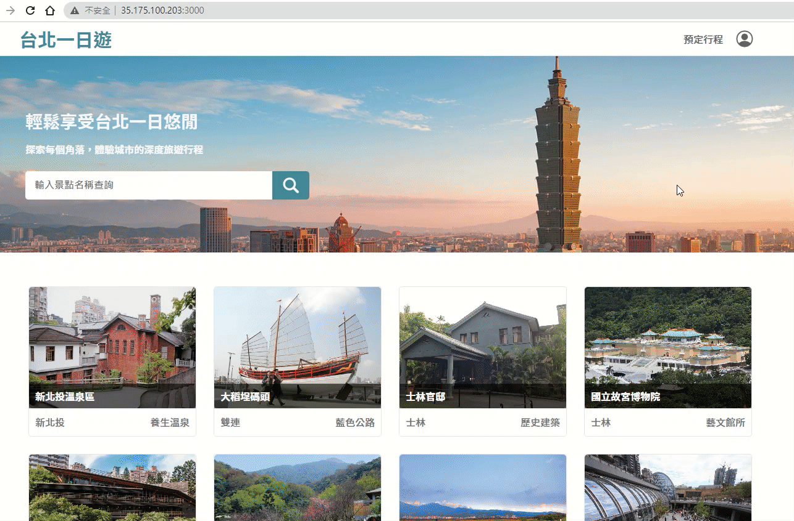

# Taipei-day-trip-website

Taipei-day-trip is a website that allows you to search for famous attractions in Taipei. You can view detailed introductions for each attraction and book guided tours to help you explore Taipei and enjoy a wonderful day.

### :link: Website URL: http://35.175.100.203:3000/

#### :woman: Test Account

|    -     |       -       |
| :------: | :-----------: |
| Account  | test@test.com |
| Password |    123456     |

#### :credit_card: Test Credit Card

|      -      |          -          |
| :---------: | :-----------------: |
| Card Number | 4242 4242 4242 4242 |
| Valid Date  |        01/24        |
|     CCV     |         123         |

## Table of Contents

- [Technical Architecture](#-Technical-Architecture)
- [Front-end Technique](#-Front-end-Technique)
- [Back-end Technique](#-Back-end-Technique)
  - [Web Framework](#Web-Framework)
  - [Database](#Database)
  - [Cloud Service](#Cloud-Service)
  - [Third-party Payment](#Third-party-Payment)
- [Main features](#-Main-features)
  - [Infinite Scroll](#Infinite-Scroll)
  - [Search Attractions](#Search-Attractions)
  - [Carousel Slider](#Carousel-Slider)
  - [Third-party Payment (TapPay)](<#Third-party-Payment-(TapPay)>)
  - [Form Validation](#Form-Validation)
  - [Member Page](#Member-Page)
- [Contact](#Contact)

## ✦ Technical Architecture

## ✦ Front-end Technique

- HTML/CSS/JavaScript
- AJAX
- Responsive Web Design(RWD)

## ✦ Back-end Technique

### Web Framework

- Python Flask
- RESTful API

### Database

- MySQL

### Cloud Service

- AWS EC2 (Ubuntu)

### Third-party Payment

- TapPay

## ✦ Main features

### Infinite Scroll

- Use the JavaScript **Intersection Observer API** to implement the **Infinite Scroll** effect.

### Search Attractions

- You can search for attractions by categories or keywords.

### Carousel Slider

- Create a **Carousel Slider** for attraction pictures that allows easy viewing of the images.

### Third-party Payment (TapPay)

- Connect to the **TapPay API**, authenticate the credit card and then proceed with the payment.

### Form Validation

- Form validation is performed both in the front-end and back-end to ensure the accuracy of data format.

### Member Page

- In member page, you can revise your name and password.

## Contact

- 🐣 Szu-An, Chen
- 📧 Email: k890244@gmail.com
